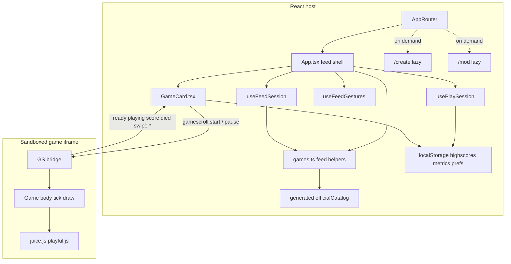

# Gamescroll — webapp and integration

Gamescroll is a TikTok-style vertical feed of tiny HTML/canvas minigames. The React host owns browsing, play/pause, scores, and share; each game runs in a sandboxed iframe and talks to the host over `postMessage`.

**Live domains**

| Domain | Role |
|--------|------|
| [gamescroll.dasali.me](https://gamescroll.dasali.me) | Primary web deploy (Hostinger) |
| [play.thehappylab.com](https://play.thehappylab.com) | Product / Happylab surface |

Share links use the current origin (`window.location`), so both domains deep-link the same way (`?g=<gameId>`).

---

## Stack

| Layer | Choice |
|-------|--------|
| UI | React 19 + TypeScript |
| Bundler | Vite 7 |
| Native | Capacitor 8 (Android only) |
| Games | Static HTML + canvas in `public/games/` + approved UGC from Supabase Storage |
| Backend | Supabase (Auth, Postgres, Storage, Edge Functions) for the game creator |
| Creator | [play.thehappylab.com/create](https://play.thehappylab.com/create) — see [CREATOR.md](CREATOR.md) |

```bash
npm install
npm run dev          # Vite local
npm run build        # tsc + vite → dist/
npm run cap:sync     # build + sync Android
npm run build:apk    # debug APK → dist-apk/
```

Regenerate game HTML after editing the generator:

```bash
node scripts/generate-games.mjs
```

---

## Architecture


```mermaid
flowchart TB
  subgraph host [React host]
    Router[AppRouter]
    App[App.tsx feed shell]
    Feed[useFeedSession]
    Play[usePlaySession]
    Gestures[useFeedGestures]
    Card[GameCard.tsx]
    Catalog[generated officialCatalog]
    GamesMod[games.ts feed helpers]
    Create["/create lazy"]
    Mod["/mod lazy"]
    Store[localStorage highscores metrics prefs]
    Router --> App
    Router -.->|on demand| Create
    Router -.->|on demand| Mod
    App --> Feed
    App --> Play
    App --> Gestures
    App --> Card
    App --> GamesMod
    GamesMod --> Catalog
    Feed --> GamesMod
    Play --> Store
    Card --> Store
  end

  subgraph iframe [Sandboxed game iframe]
    Bridge[GS bridge]
    Body[Game body tick draw]
    Juice[juice.js playful.js]
    Bridge --> Body
    Body --> Juice
  end

  Card -->|"gamescroll:start / pause"| Bridge
  Bridge -->|"ready playing score died swipe-*"| Card
```

`/` ships the feed shell only. `/create` and `/mod` are code-split (`React.lazy` + `Suspense`) so the creator and moderation UIs are not in the initial feed JS chunk.
### Host (`src/`)

| File | Role |
|------|------|
| `App.tsx` | Composition shell: wires hooks, nav glue (`goToNext` / `goToPrev`), chrome JSX |
| `hooks/useFeedSession.ts` | Boot / UGC community, jackpot intro, append/prune window, activeIndex, scroll |
| `hooks/usePlaySession.ts` | playingKey, scores, game-over, auto-restart, rail hint, cue/nudge, deploy reload |
| `hooks/useFeedGestures.ts` | Keyboard, intro cancel, nudge swipe, silent-rail swipe, play-mode scroll lock |
| `games.ts` | Feed helpers + `Game` type; official list from `generated/officialCatalog.ts` |
| `generated/officialCatalog.ts` | Emitted `{ id, title, tip, accent }` (from `generate-games.mjs`) |
| `components/GameCard.tsx` | iframe load + bridge |
| `components/BottomNav.tsx` | fixed bottom like/share nav for the active game |
| `components/GameOverOverlay.tsx` | Fail UI when auto-restart is off |
| `components/SwipeCue.tsx` | Brief “Swipe / Next game” chip (5s after intro) |
| `lib/feedIntro.ts` | Jackpot reel sequence (every cold start) |
| `lib/feedWindow.ts` | Sliding-window append/prune + scroll-index remap |
| `lib/feedMessageHub.ts` | Single `window` `message` dispatcher for loaded cards |
| `lib/playPresentation.ts` | Symmetric play insets + rail-hint visibility helpers |
| `AppRouter.tsx` | Routes; `/create` and `/mod` are `React.lazy` + `Suspense` |
| `lib/ugc.ts` | UGC fetch helpers; slim column lists per call site (feed / mod / my games) |
| `lib/feedBoot.ts` | Parallel community + `?g=` slug resolution for feed boot |
| `share.ts` | `?g=` deep links + Web Share / clipboard |
| `highscores.ts` | Per-game best scores |
| `metrics.ts` | Visits + sparse feed telemetry batcher |
| `experiments.ts` | Auto-restart preference ↔ iframe `onFail` |
| `updateCheck.ts` | Poll `/version.json` every 12s; cache-bust reload when a new deploy is live |

### Games (`public/games/` + generator)

| Path | Role |
|------|------|
| `scripts/generate-games.mjs` | Source of truth for game bodies + shared bridge; emits HTML and `officialCatalog.ts` |
| `public/games/<id>.html` | Generated pages loaded by iframes |
| `public/lib/{gsap,proton,juice,playful}.js` | Shared FX / drawing helpers inside iframes |

---

## Game catalog and authoring

1. Implement a game body in the `games` object in `scripts/generate-games.mjs` with `title`, `tip`, `bg` (and optional `accent`).
2. Run `node scripts/generate-games.mjs` (or `npm run generate:games`) to write `public/games/<id>.html` and regenerate `src/generated/officialCatalog.ts`.
3. The host catalog in `src/games.ts` imports that generated list (no hand-maintained title/tip/accent duplicate).

The host feed is a shuffled batch of the full catalog (`buildFeedBatch`). Near the end of the list, another batch is appended so the scroll feels endless.

Iframes load only for the active card and its immediate neighbors (`isActive || isPlaying`), with `sandbox="allow-scripts"` (no same-origin storage inside games).

---

## Host ↔ game bridge

Messages use the `gamescroll:` prefix. Origin is `'*'` (static same-site iframes).

### Game → host

| Type | Payload | When |
|------|---------|------|
| `gamescroll:ready` | — | Bridge finished init |
| `gamescroll:playing` | — | First successful start (emitted; host does not require it) |
| `gamescroll:score` | `{ score }` | Score updates / pause halt |
| `gamescroll:died` | `{ score }` | Fail when `onFail === 'gameover'` |
| `gamescroll:swipe-next` | — | Strong vertical fling up |
| `gamescroll:swipe-prev` | — | Strong vertical fling down |

### Host → game

| Type | Payload | When |
|------|---------|------|
| `gamescroll:start` | `{ onFail?: 'replay' \| 'gameover' }` | Enter play / play again |
| `gamescroll:pause` | — | Leave play / pause |

**Typical play session**

1. Card becomes playing → iframe loads → game posts `ready`.
2. Host posts `start` with `onFail` from the auto-restart preference.
3. Game unpauses, posts `playing`, reports `score` while running.
4. On fail: either in-iframe reset (`replay`) or `died` + host overlay (`gameover`).
5. Strong vertical flings inside the iframe forward `swipe-next` / `swipe-prev` so the feed can move even while the iframe captures pointers.

In-iframe swipe thresholds: distance ≥ `max(140, 0.22 × height)`, duration ≤ 350ms, and vertical dominance `|dy| ≥ dx × 2.2`.

---

## Feed, controls, and share

- CSS snap feed (`.feed`); while playing, scroll is locked.
- Switch games: iframe fling, thin invisible right-edge swipe capture, keys `↓`/`j` and `↑`/`k`.
- While playing, the iframe is letterboxed away from host chrome (top bar, bottom like/share nav, equal side gutters) so game hit-targets cannot sit under app UI.
- A dark scroll-rail hint may show before the first game starts; after `enterPlay` it stays gone (only the invisible edge capture remains).
- Like and Share sit in a viewport-fixed bottom navigation bar under the playfield (never overlaid on the game, never scrolls with the feed).
- **Pause** / Esc freezes the current game; after pause, a nudge encourages swiping to the next card.
- Every cold start (including shared `?g=` links): a jackpot-style feed reel scrolls through a few cards and lands on index `0`, then autoplay starts. Skipped only for `prefers-reduced-motion`.
- `SwipeCue` cream chip (“Swipe for the next game”) shows for 5 seconds after the intro (or until the first swipe), then hides.
- `prefers-reduced-motion`: skip the reel, jump to the landing card, show the cue, autoplay.
- Feed length is capped with a sliding window (`feedWindow`); prune remaps `activeIndex` and compensates `scrollTop`.

### Deep links

```
https://gamescroll.dasali.me/?g=flappy
https://play.thehappylab.com/?g=pong
```

`readSharedGameParam()` / `getGameById` pin a catalog id when present. If the slug is UGC-only, feed boot fetches that row **in parallel** with the approved community list (`resolveFeedBoot`), then rebuilds the first batch and autoplays after the intro reel. Share uses `navigator.share` or clipboard copy of the absolute `?g=` URL.

### Query prefs

| Param | Effect |
|-------|--------|
| `?autorestart=1\|0` | Force auto-restart on/off (persisted) |
| `?fail=replay\|gameover` | Legacy alias for the same |

---

## Fail modes (auto-restart)

| Auto-restart | `onFail` | On die |
|--------------|----------|--------|
| On (default) | `replay` | Game resets inside the iframe; no host overlay |
| Off | `gameover` | Game posts `died`, host shows `GameOverOverlay` (Play again / Play another) |

Preference resolution: URL → `localStorage` (`gs_auto_restart`, legacy `gs_fail_mode`) → default `true`.

---

## Persistence (`localStorage`)

Owned by the host (sandboxed games cannot use storage).

| Key | Purpose |
|-----|---------|
| `gs_highscores` | Best score per game id |
| `gs_uid` | Anonymous visitor id |
| `gs_visits` / `gs_last_seen` | Daily visit counting |
| `gs_auto_restart` | Auto-restart preference |
| `gs_fail_mode` | Legacy fail-mode preference |

Likes in the bottom-nav control are in-memory only for the session.

---

## Android (Capacitor)

| Item | Value |
|------|--------|
| Config | `capacitor.config.ts` |
| App id | `com.gamescroll.app` |
| Web assets | `webDir: dist` |
| Orientation | Portrait (`AndroidManifest.xml`) |

```bash
npm run build:apk
```

Produces a debug APK under `dist-apk/`. The native shell embeds the built static site (no OTA). APK build expects a local Android SDK / JDK (`ANDROID_HOME` / `JAVA_HOME`).

---

## Deploy and update channel

There is no in-repo CI. Typical web deploy:

1. `npm run build`
2. Upload `dist/` to Hostinger FTP (`gamescroll.dasali.me`)

Credentials live in gitignored `.env.local` (`HOSTINGER_FTP_*`, Supabase admin tokens).

Production Vite builds also read committed `.env.production` for the **public** Supabase URL + anon key (safe with RLS). Happylab’s auto-deploy needs that so `/create` and UGC deep links work without copying `.env.local` onto the build server.

Each Vite build emits `/version.json` and injects `__BUILD_ID__`. The client polls every 12s (`updateCheck.ts`), also on tab focus/visibility, and reloads with a cache-busting `?_gsb=` navigation when a new build is live. Mid-game updates wait for Pause or the next swipe so play isn’t interrupted. Hostinger `.htaccess` marks `index.html` / `version.json` as `no-cache` so the shell isn’t sticky.

Git remotes in use:

- `origin` → `dasali-jenario/gamescroll`
- `thehappylab` → `thehappylab/gamescroll`

---

## Adding or changing a game

1. Edit or add the game body in `scripts/generate-games.mjs` (`title`, `tip`, `bg`, optional `accent`, `body`).
2. Run `npm run generate:games` (writes HTML + `src/generated/officialCatalog.ts`).
3. Smoke-test in the feed (`npm run dev`), including pause, score, fail, and swipe.
4. Run `npm run quality` so catalog↔HTML integrity, catalog `--check`, and host unit tests still pass.

To remove a game, delete the generator block and add the HTML filename to the generator’s `obsolete` list so regenerating cleans `public/games/` (and drops it from the emitted catalog).

---

## User-generated games

Players can build single-player HTML5 games via the chatbot at `/create` ([setup](CREATOR.md)).

| Status | Visibility |
|--------|------------|
| `draft` | Creator only |
| `published` | Creator + anyone with `?g=<slug>` (not in main feed) |
| `approved` | Interleaved into the swipe feed |
| `rejected` | Creator can iterate and republish |

UGC HTML must pass the same host bridge contract and forbid multiplayer / network / saved-state APIs (`src/lib/gameValidator.ts`). Creator bodies are also required to match official catalog structure: HTML5/JS canvas with `layout` / `tick` / `draw` / `die` / `onHostStart` / `scorePos` / `diePos` and PF drawing helpers (`PF.sky` + layers), same shell as `scripts/generate-games.mjs`.

---

## Quality checks

| Command | What it runs |
|---------|----------------|
| `npm run typecheck` | `tsc -b` (app sources; `*.test.ts` excluded) |
| `npm test` | Vitest unit tests under `src/**/*.test.ts` |
| `npm run generate:games` | Write `public/games/*.html` + `src/generated/officialCatalog.ts` |
| `npm run sync:shared` | Regenerate Deno `_shared` twins from `src/lib` |
| `npm run quality` | typecheck + tests + `sync-shared --check` + `generate-games --check` |

Coverage today:

- Catalog shape, feed keys, share deep links, highscores, auto-restart prefs
- Catalog ids ↔ `public/games/*.html`, bridge message contract, culled games stay gone
- Generated `officialCatalog.ts` stays in sync with `generate-games.mjs`
- UGC wrap/validator (forbidden APIs + bridge snippets)
- Feed window prune, message hub, blob LRU, play presentation, App hook-shell contract
- Lazy `/create`+`/mod`, slim UGC selects, parallel share boot
- Deno `_shared` parity with `src/lib` (via sync check)

CI: [`.github/workflows/quality.yml`](../.github/workflows/quality.yml) runs `npm run quality` on push/PR to `main`.
